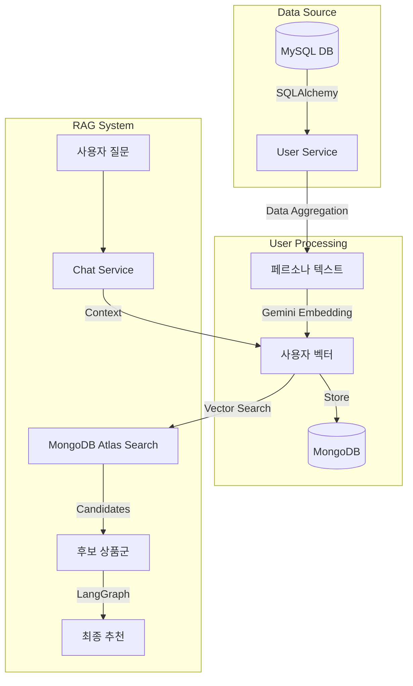

# 노후하우 AI 서버 (KnowWhoHow AI Server)

## 1. 프로젝트 개요

본 프로젝트는 크게 **데이터 파이프라인(Airflow)** 과 **API 서버(FastAPI)** 로 구성되어 있습니다.

AI 서버는 사용자의 마이데이터와 금융 성향을 전처리 및 벡터화하여, **RAG(Retrieval-Augmented Generation)**를 활용하여 개인 맞춤형 금융 상품(예금, 적금, 펀드, 연금)을 추천하고 상담해주는 서버입니다.

특히 **Airflow**를 활용하여 금융위원회, 금융감독원 등 **다양한 공공 데이터 OpenAPI**로부터 최신 금융 상품 정보를 주기적으로 수집하고 전처리하여 데이터의 **신선도(Freshness)**를 유지합니다. 수집된 데이터와 벡터 임베딩은 Cloud NoSQL DB인 **MongoDB Atlas**에 적재되어, 고성능의 하이브리드 검색(Hybrid Search)을 지원합니다.

## 2. 주요 기능

-   **개인 맞춤형 상품 추천**: 사용자의 자산 현황, 투자 성향, 연령대 등을 분석하여 최적의 금융 상품 추천.
-   **지능형 챗봇 상담**: 금융 상품에 대한 질의응답을 실시간 스트리밍으로 제공.
-   **데이터 최신화 (ETL)**: 금융위원회 및 각 금융사 데이터를 주기적으로 수집, 전처리, 임베딩하여 벡터 DB에 적재.
-   **유저 페르소나 벡터화**: 사용자 데이터를 텍스트화 및 벡터화하여 유사도 검색에 활용.

## 3. 기술 스택 (Tech Stack)

### 3.1. Server (EC2 / Local)

-   **Framework**: FastAPI
-   **Language**: Python 3.10+
-   **AI & LLM**:
    -   LangChain (Core, Community, Google GenAI)
    -   Google Gemini Pro (Generative AI)
    -   LangGraph (Agent Workflow)
-   **Database**:
    -   MongoDB Atlas (Vector Store & Data Lake)
    -   MySQL (User Data - Read Only)
-   **Deployment**: Docker, Uvicorn

### 3.2. Airflow (On-Premise)

-   **Orchestrator**: Apache Airflow 3.1.1
-   **Executor**: Celery Executor
-   **Message Broker**: Redis
-   **Metadata DB**: PostgreSQL
-   **Key Libraries**:
    -   `pandas`, `requests` (Data Processing)
    -   `pymongo` (DB Interaction)
    -   `langchain-google-genai` (Embedding Generation)

## 4. 디렉토리 구조

```bash
main-project-ai/
├── airflow/                  # Airflow 관련 설정 및 DAG
│   ├── dags/                 # 데이터 파이프라인 (ETL) 정의
│   ├── config/               # Airflow 설정 파일
│   ├── Dockerfile            # Airflow 커스텀 이미지 빌드 설정
│   └── requirements.txt      # Airflow 의존성 패키지
├── server/                   # AI API 서버
│   ├── app/                  # FastAPI 애플리케이션 코드
│   │   ├── api/              # API 라우터 (v1)
│   │   ├── core/             # 설정(Config) 및 공통 모듈
│   │   ├── services/         # 비즈니스 로직 (RAG, Chatbot 등)
│   │   └── main.py           # 앱 진입점
│   ├── Dockerfile            # Server 이미지 빌드 설정
│   └── requirements.txt      # Server 의존성 패키지
├── docker-compose.local.yml  # 로컬 개발 환경 실행 설정 (Airflow + Server + Mongo)
└── scripts/                  # 유틸리티 스크립트
```

## 5. APIs

주요 API 엔드포인트는 다음과 같습니다. 상세 명세는 서버 실행 후 `/docs`에서 확인할 수 있습니다.

| Method | Endpoint                            | Description                            |
| :----- | :---------------------------------- | :------------------------------------- |
| `GET`  | `/`                                 | 서버 상태 및 버전 정보 확인            |
| `GET`  | `/api/v1/recommendations/{user_id}` | 특정 유저를 위한 맞춤형 금융 상품 추천 |
| `POST` | `/api/v1/chat/stream`               | 챗봇과의 대화 (스트리밍 응답)          |
| `POST` | `/api/v1/chat/feedback`             | 추천/상담 결과에 대한 피드백 저장      |
| `POST` | `/api/v1/users/{user_id}/vectorize` | 유저 데이터 벡터화 및 갱신 (트리거)    |

### 5.1. Admin APIs

관리자 페이지를 위한 통계 및 로그 조회 API입니다.

| Method | Endpoint                       | Description                       |
| :----- | :----------------------------- | :-------------------------------- |
| `GET`  | `/api/v1/admin/stats/overview` | 대시보드 전체 통계 조회           |
| `GET`  | `/api/v1/admin/stats/trends`   | 대화 및 API 요청 추이 조회        |
| `GET`  | `/api/v1/admin/stats/feedback` | 피드백 분포 조회                  |
| `GET`  | `/api/v1/admin/users`          | 사용자별 AI 사용 통계 조회        |
| `GET`  | `/api/v1/admin/logs`           | 챗봇 대화 로그 목록 조회          |
| `GET`  | `/api/v1/admin/logs/{user_id}` | 특정 사용자의 대화 상세 내역 조회 |

## 6. 배포 정보

-   **Production URL**: [https://knowwhohow.cloud/ai](https://knowwhohow.cloud/ai)
-   **Dev/Client URL**: [https://knowwhohow.site](https://knowwhohow.site)

## 7. 실행 가이드 (로컬 환경)

### 사전 요구사항

-   Docker 및 Docker Compose 설치
-   `.env` 파일 설정 (각 디렉토리의 `.env.example` 참고)

### Airflow 실행

```bash
# airflow 루트에서 실행
docker-compose up -d --build
```

### 개별 실행 (Server Only)

```bash
cd server
pip install -r requirements.txt

python -m uvicorn app.main:app --reload --host 0.0.0.0 --port 8000
```

## 8. 결과

-   **API Server**: [http://localhost:8000](http://localhost:8000) 접속 시 서버 상태 확인 가능.
-   **API Docs**: [http://localhost:8000/docs](http://localhost:8000/docs) 에서 Swagger UI 확인.
-   **Airflow Webserver**: [http://localhost:8080](http://localhost:8080) 접속 (ID/PW: `airflow`/`airflow` 설정 시).


---

## 🛠️ ServerTech Stack Overview (기술 스택)

| Category | Technology | Usage |
| :--- | :--- | :--- |
| **Language** |  | 서버 및 데이터 파이프라인(Airflow) 핵심 로직 구현 |
| **Database (RDBMS)** |  | 사용자 정보(회원, 계좌, 자산 등)의 원천 데이터 저장 |
| **Database (NoSQL)** |  | 벡터 스토어(임베딩 저장), 로그, 비정형 데이터 관리 |
| **Embedding** |  | **Google text-embedding-004**: 텍스트를 고차원 벡터로 변환 |
| **Framework** |  | RAG(검색 증강 생성) 파이프라인 및 Agent 구축 |
| **Vector Search** |  | **Vector Search Index**: 데이터 중 유사 데이터 초고속 검색 |
| **ORM** |  | Python 객체와 관계형 데이터베이스(MySQL) 간 매핑 |

---

## 1. 사용자 페르소나 정의 (User Vectorization)
가장 먼저, RDBMS에 흩어져 있는 사용자 데이터를 조회하여 AI가 이해 가능한 **"텍스트 서사(Persona)"**로 변환합니다.

### 👤 데이터 조회 (MySQL + SQLAlchemy)
`UserVectorizationService`는 **SQLAlchemy**를 사용하여 MySQL에서 다음 데이터를 직접 쿼리합니다.
*   **Users 테이블**: 나이, 성별, 투자 성향
*   **Assets 테이블**: 자산 규모 및 포트폴리오(예적금, 부동산 등) 분포
*   **UserInfo 테이블**: 연 소득, 은퇴 목표, 희망 생활비
*   **Keyword 테이블**: 사용자가 선택한 관심 키워드

### 📝 페르소나 생성 & 임베딩
조회된 데이터를 자연어 텍스트로 합친 후 임베딩합니다.
*   **Model**: `Google text-embedding-004` (via `langchain-google-genai`)
*   **Process**: 텍스트 -> 768차원(예시) 벡터 변환
*   **Storage**: 결과 벡터는 **MongoDB** `user_vectors` 컬렉션에 저장됩니다.

---

## 2. 금융상품 지식화 (Product Vectorization)
금융상품 데이터 역시 AI가 검색할 수 있도록 벡터화되어 준비됩니다.

### 🔄 데이터 파이프라인 (Airflow ETL)
매일 새벽, **Airflow** DAG가 금융기관(금감원, 금융위, KVIC) API를 호출합니다.
1.  **Extract**: JSON 데이터 수집
2.  **Transform**: 상품 특징, 우대 조건 등을 `rag_text` 필드로 가공
3.  **Embed**: 동일한 **Gemini Embedding** 모델을 사용하여 벡터 생성
4.  **Load**: **MongoDB**에 적재 (API 서버와 공유하는 DB)

---

## 3. 매칭 및 추천 (RAG & Vector Search)
사용자가 질문을 하면, 시스템은 **사용자 벡터**와 **상품 벡터**를 비교하여 가장 적합한 상품을 찾아냅니다.

### 1단계: 검색 (MongoDB Atlas Vector Search)
*   사용자의 질문 + 페르소나를 결합하여 쿼리 벡터를 생성합니다.
*   **MongoDB Atlas**의 `vectorSearch` 기능을 사용하여 코사인 유사도(Cosine Similarity)가 높은 상위 상품을 검색합니다.
    *   *효과: 단순 키워드 매칭이 아닌, "맥락"에 맞는 상품 검색 가능*

### 2단계: 에이전트 분석 (LangGraph)
검색된 후보 상품들과 사용자 페르소나를 **LangGraph** 기반의 Agent에게 전달합니다.
*   **Prompt**: "당신은 금융 전문가입니다. [사용자 페르소나]와 [검색된 상품]을 보고 최적의 상품을 추천해주세요."
*   **Output**: 추천 사유가 담긴 정형화된 JSON 데이터

---

## 4. 피드백 및 최적화 (Feedback Loop)
추천은 일방적이지 않고 사용자의 반응에 따라 계속 진화합니다.

### 👍👎 재정렬 로직 (Hybrid Filtering)
사용자가 챗봇에서 남긴 '좋아요/싫어요' 로그는 MongoDB `chat_logs`에 저장됩니다.
*   **Logic**: `ProductsService`에서 추천 결과를 반환하기 전, MongoDB 로그를 조회하여 **Dislike** 상품은 필터링하고 **Like** 상품은 가중치를 부여해 재정렬합니다.

---

## 🛠️ 요약 다이어그램


