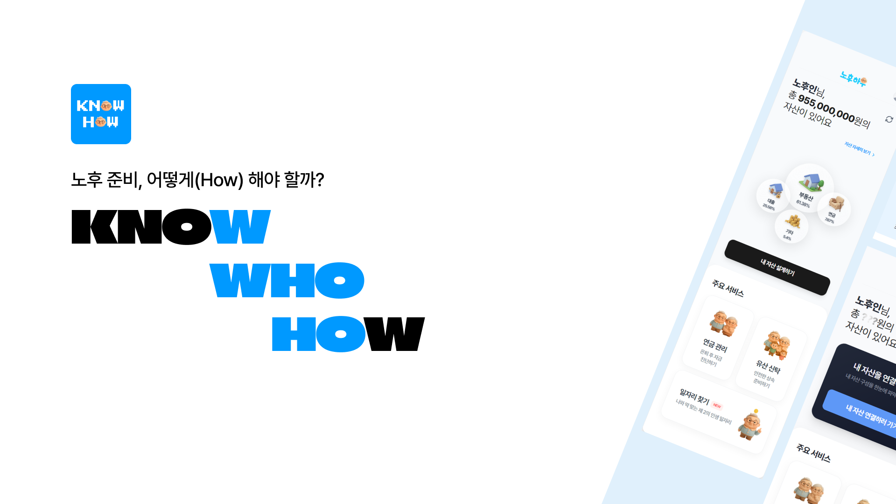
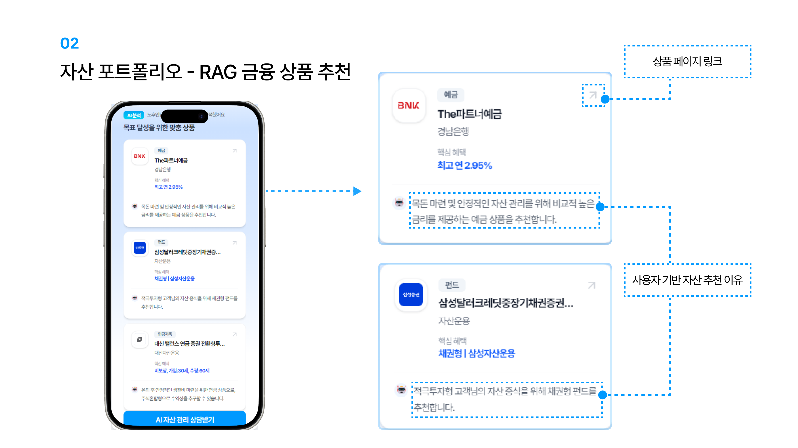
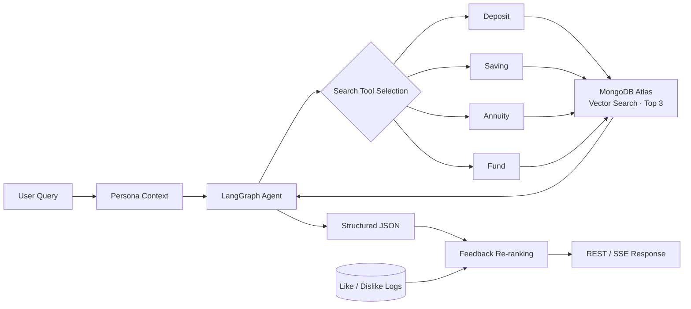
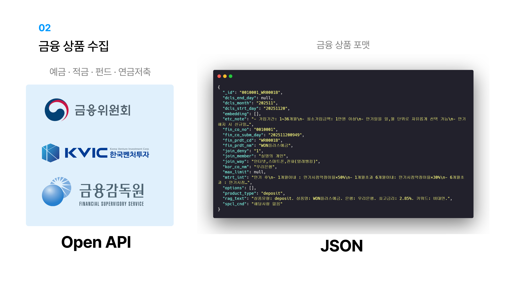
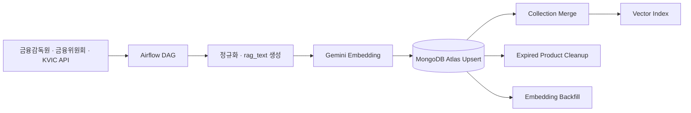
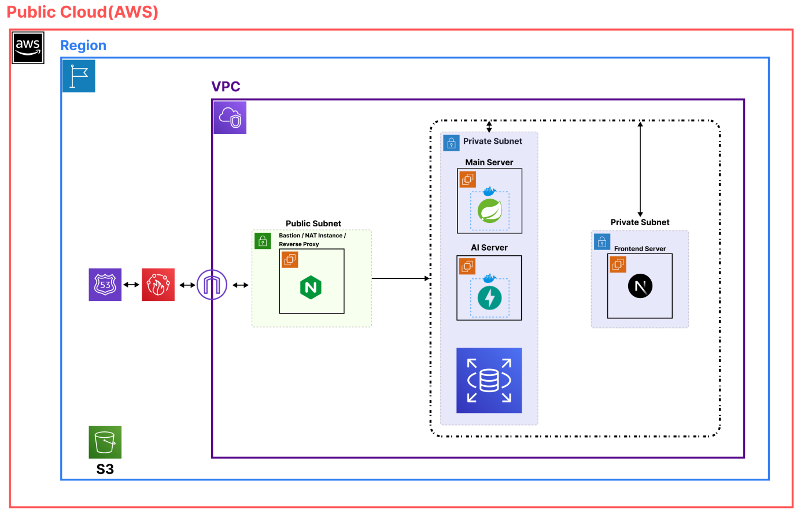

<div align="center">



# 노후하우 AI Server

### 사용자 페르소나와 금융상품 벡터 검색을 결합한 노후 자산관리 RAG 서버

<p>
  
  
  
  
  
  
</p>

[Repository](https://github.com/Fisa5-Main-Project/ai-server)

</div>

## 프로젝트 소개

사용자 자산·은퇴 목표·투자 성향을 바탕으로 금융상품을 추천하는 서버다. MySQL 사용자 정보를 **페르소나 문장**으로 정리하고, MongoDB Atlas **Vector Search**에서 예금·적금·연금저축·펀드 후보를 찾는다. LangGraph가 검색 도구를 선택하며, 추천 결과는 JSON 또는 SSE로 전달한다. 좋아요·싫어요 기록은 다음 추천의 정렬 기준으로 사용한다.

## 서비스 화면

### 개인 맞춤형 금융상품 추천



사용자 자산과 목표 키워드를 기준으로 상품 후보와 추천 이유를 함께 제공한다.

## AI Pipeline


```mermaid
flowchart LR
    A[User Query] --> B[Persona Context]
    B --> C[LangGraph Agent]
    C --> D{Search Tool Selection}
    D --> E1[Deposit]
    D --> E2[Saving]
    D --> E3[Annuity]
    D --> E4[Fund]
    E1 & E2 & E3 & E4 --> F[MongoDB Atlas<br/>Vector Search · Top 3]
    F --> C
    C --> G[Structured JSON]
    G --> H[Feedback Re-ranking]
    H --> I[REST / SSE Response]
    J[(Like / Dislike Logs)] --> H
```

| 단계       | 처리                                                                              |
| ---------- | --------------------------------------------------------------------------------- |
| Persona    | 연령, 투자 성향, 자산, 소득, 은퇴 목표, 관심 키워드를 하나의 사용자 문맥으로 구성 |
| Retrieval  | 에이전트가 상품군별 검색 도구를 호출하고 벡터 유사도 상위 3개 후보를 조회         |
| Generation | 검색 결과와 페르소나를 바탕으로 추천 상품·혜택·이유를 JSON으로 생성               |
| Re-ranking | 싫어요 상품은 제외하고 좋아요 상품은 상단에 배치                                  |
| Delivery   | 추천 API 또는 챗봇 SSE 스트림으로 상품·답변·후속 질문을 전달                      |

## Retrieval & Personalization

```text
MySQL User Data
  → Persona Text + Embedding
  → MongoDB user_vectors

User Query + Persona Text
  → LangGraph Tool Calling
  → Product Vector Search (k=3)
  → LLM Structured Output
  → Feedback Re-ranking
```

- **페르소나 문맥**: 사용자 정보를 페르소나 텍스트와 임베딩으로 저장한다. 온라인 추천에는 페르소나 텍스트를 에이전트 문맥으로 사용한다.
- **동일 임베딩 공간**: 검색 질의와 금융상품 `rag_text`를 `text-embedding-004`로 벡터화해 유사도를 계산한다.
- **카테고리별 검색**: 예금·적금·연금저축·펀드 컬렉션을 분리한다. 예금/적금은 `product_type` 메타데이터로 한 번 더 필터링한다.
- **Agentic Retrieval**: LangGraph가 질문과 페르소나에 맞는 검색 도구를 고르고, 도구 결과를 다음 추론 문맥에 넣는다.

## Data Pipeline




```mermaid
flowchart LR
    A[금융감독원 · 금융위원회 · KVIC API] --> B[Airflow DAG]
    B --> C[정규화 · rag_text 생성]
    C --> D[Gemini Embedding]
    D --> E[(MongoDB Atlas Upsert)]
    E --> F[Collection Merge]
    E --> G[Expired Product Cleanup]
    E --> H[Embedding Backfill]
    F --> I[Vector Index]
```

상품군별 DAG가 원천 데이터를 수집하고 검색용 텍스트와 임베딩을 생성한다. 유지보수 DAG는 만기 상품 정리, 컬렉션 통합, 누락 임베딩 보강을 맡는다.

## System Architecture



온프레미스 Airflow가 금융상품 데이터를 수집한다. AWS 내부의 FastAPI 서버는 메인 서버·클라이언트와 통신하며, MySQL에서 사용자 원천 데이터를 읽는다. 상품 벡터·사용자 벡터·대화 및 피드백 로그는 MongoDB Atlas에 저장한다.

## 기술 스택

| Area      | Technology                        | Role                                    |
| --------- | --------------------------------- | --------------------------------------- |
| LLM       | Gemini 2.5 Flash / Groq Qwen3-32B | 추천 근거 생성, 스트리밍 상담           |
| Agent     | LangGraph, LangChain              | 검색 도구 선택과 Agent-Tool 반복 실행   |
| Embedding | Google `text-embedding-004`       | 사용자·상품 텍스트 벡터화               |
| Retrieval | MongoDB Atlas Vector Search       | 상품군별 의미 기반 Top-K 검색           |
| AI API    | FastAPI, Uvicorn                  | 추천·벡터화·SSE 챗봇 API                |
| Data      | Apache Airflow, Pandas, PyMongo   | 금융상품 ETL·임베딩·적재·정리           |
| Storage   | MongoDB Atlas, MySQL              | 벡터/로그 저장, 사용자 원천 데이터 조회 |

## 평가

평가 기준일: `2025-12-09`

| 평가            | 데이터와 기준                                                              |                    결과 |
| --------------- | -------------------------------------------------------------------------- | ----------------------: |
| RAG 시나리오    | 추천·지식·보안·일상대화 등 53개 질의의 의도/키워드/상품 반환 검증          |       **46/53 (86.8%)** |
| Retrieval       | 추천 및 특정 상품 검색 25개 질의에서 기대 키워드가 Top-K에 포함되는지 확인 | **Recall@1/3/5 = 0.92** |
| API 단위 테스트 | Chat·Recommendation·Vectorization·Admin, 외부 의존성 Mock                  |          **38/38 통과** |

평가 원본은 [`rag_eval_result_final_20251209.csv`](server/tests/evaluation/rag_eval_result_final_20251209.csv), 테스트 범위는 [`test_results_report.md`](server/tests/test_results_report.md)에 정리돼 있다.

## 기술적 문제와 해결

<details>
<summary><strong>LLM 응답의 JSON 파싱 안정화</strong></summary>

초기에는 `json.loads()`만 사용해 코드 블록이나 부가 문장이 포함된 응답을 처리하지 못했다. JSON 코드 블록 → 일반 코드 블록 → 최외곽 객체 순서로 본문을 추출하고, 표준 파싱 실패 시 리터럴 파싱을 한 번 더 시도하도록 보완했다.

</details>

<details>
<summary><strong>사용자 반응을 반영한 추천 재정렬</strong></summary>

벡터 유사도만으로 정렬하면 사용자가 싫어요를 남긴 상품이 다시 노출될 수 있다. 사용자별 피드백 로그를 조회해 `dislike` 상품을 제외하고 `like` 상품을 우선 배치했다. 모델 재학습 없이 다음 추천부터 바로 반영된다.

</details>

<details>
<summary><strong>금융상품 데이터 신선도 유지</strong></summary>

만기되거나 갱신된 상품이 검색 후보에 남지 않도록 수집 DAG와 유지보수 DAG를 분리했다. 만기 상품 정리, 컬렉션 통합, 임베딩 backfill을 자동화해 검색 인덱스의 상태를 일정하게 유지한다.

</details>

## Core API

| Method | Endpoint                            | Description                        |
| ------ | ----------------------------------- | ---------------------------------- |
| `GET`  | `/api/v1/recommendations/{user_id}` | 사용자 페르소나 기반 금융상품 추천 |
| `POST` | `/api/v1/chat/stream`               | SSE 기반 AI 상담                   |
| `POST` | `/api/v1/chat/feedback`             | 상품 좋아요·싫어요 저장            |
| `GET`  | `/api/v1/chat/history`              | 세션별 대화 내역 조회              |
| `POST` | `/api/v1/users/{user_id}/vectorize` | 사용자 페르소나 생성 및 벡터 갱신  |
| `GET`  | `/api/v1/admin/*`                   | 사용량·피드백·대화 로그 통계       |

## 구현 사항

- 금융상품 ETL 및 임베딩 파이프라인
- 사용자 마이데이터 기반 페르소나 생성과 벡터화
- LangGraph 상품 추천 에이전트와 카테고리별 검색 도구
- 구조화 추천 API, SSE 챗봇, 피드백 재정렬
- RAG 시나리오 평가와 API 단위 테스트

<details>
<summary><strong>Directory Structure</strong></summary>

```text
ai-server/
├── airflow/
│   ├── dags/                 # 상품 수집·임베딩·정리 DAG
│   └── plugins/etl_utils.py  # 공통 ETL 로직
├── server/
│   ├── app/api/              # FastAPI endpoints
│   ├── app/rag/              # LangGraph, tools, prompts
│   ├── app/services/         # 추천·채팅·벡터화 서비스
│   └── tests/                # API 및 RAG 평가
├── scripts/                  # 데이터 보정 유틸리티
└── docker-compose.local.yml
```

</details>
