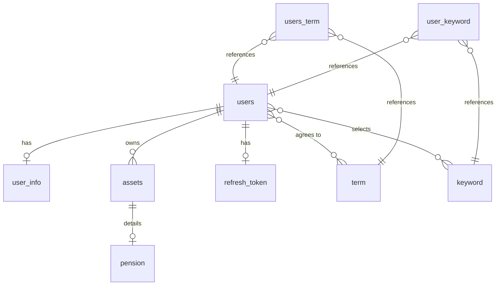

# MySQL Database Schema - LLM Reference

## Database Overview
This document describes the MySQL database schema for a financial management application. The database contains 10 main entities managing users, financial products, assets, keywords, terms, and authentication tokens.

---

## Table Definitions

### 1. users
**Purpose**: Core user account information and authentication

| Column | Type | Constraints | Description |
|--------|------|-------------|-------------|
| user_id | BIGINT | PRIMARY KEY, AUTO_INCREMENT | Unique user identifier |
| login_id | VARCHAR | NOT NULL, UNIQUE | User login ID |
| password | VARCHAR | NOT NULL | Encrypted password |
| phone_num | VARCHAR | NOT NULL | Phone number |
| birth | DATE | NOT NULL | Date of birth |
| gender | ENUM | NOT NULL | Gender (M, F) |
| name | VARCHAR(50) | NOT NULL | User's name |
| asset_total | BIGINT | NULLABLE | Total asset value |
| investment_tendancy | ENUM | NULLABLE | Investment tendency type |
| provider | VARCHAR | NULLABLE | OAuth2 provider (e.g., "kakao") |
| provider_id | VARCHAR | NULLABLE, UNIQUE | OAuth2 provider's unique ID |
| user_mydata_registration | BOOLEAN | NOT NULL | MyData integration status |

**Relationships**:
- One-to-One with `user_info`
- One-to-Many with `assets`
- One-to-One with `refresh_token`
- Many-to-Many with `term` (via `users_term`)
- Many-to-Many with `keyword` (via `user_keyword`)

---

### 2. user_info
**Purpose**: Extended user information for financial planning

| Column | Type | Constraints | Description |
|--------|------|-------------|-------------|
| user_info_id | BIGINT | PRIMARY KEY, AUTO_INCREMENT | Unique identifier |
| user_id | BIGINT | FOREIGN KEY, NOT NULL, UNIQUE | Reference to users table |
| goal_amount | BIGINT | NULLABLE | Target savings goal |
| goal_target_date | DATE | NULLABLE | Goal achievement date |
| expectation_monthly_cost | BIGINT | NULLABLE | Expected monthly expenses |
| fixed_monthly_cost | BIGINT | NOT NULL | Fixed monthly costs |
| retirement_status | BOOLEAN | NULLABLE | Retirement status |
| annual_income | BIGINT | NOT NULL | Annual income |
| target_retired_age | INT | NOT NULL | Target retirement age |
| num_dependents | INT | NOT NULL | Number of dependents |
| mydata_status | ENUM | NOT NULL | MyData connection status (CONNECTED, DISCONNECTED, NONE) |

**Relationships**:
- One-to-One with `users` (user_id)

---

### 3. assets
**Purpose**: User's financial assets

| Column | Type | Constraints | Description |
|--------|------|-------------|-------------|
| asset_id | BIGINT | PRIMARY KEY, AUTO_INCREMENT | Unique asset identifier |
| user_id | BIGINT | FOREIGN KEY, NOT NULL | Reference to users table |
| type | ENUM | NOT NULL | Asset type (CURRENT, SAVING, INVEST, PENSION, AUTOMOBILE, REAL_ESTATE, LOAN) |
| balance | DECIMAL | NOT NULL | Asset balance/value |
| bank_code | VARCHAR | NULLABLE | Bank code for financial assets |

**Relationships**:
- Many-to-One with `users` (user_id)
- One-to-One with `pension` (for PENSION type assets)

---

### 4. pension
**Purpose**: Detailed pension asset information

| Column | Type | Constraints | Description |
|--------|------|-------------|-------------|
| asset_id | BIGINT | PRIMARY KEY, FOREIGN KEY | Reference to assets table (shared PK) |
| updated_at | DATETIME | NULLABLE | Last update timestamp |
| pension_type | ENUM | NULLABLE | Pension type (DB, DC, IRP) |
| account_name | VARCHAR | NOT NULL | Pension account name |
| income_avg_3m | DECIMAL(15,2) | NULLABLE | 3-month average income |
| working_date | INT | NULLABLE | Working period in days |
| principal | DECIMAL(15,2) | NULLABLE | Principal amount |
| company_contrib | DECIMAL(15,2) | NULLABLE | Company contribution |
| personal_contrib | DECIMAL(15,2) | NULLABLE | Personal contribution |
| contrib_year | INT | NULLABLE | Contribution years |
| total_personal_contrib | DECIMAL(15,2) | NULLABLE | Total personal contributions |

**Relationships**:
- One-to-One with `assets` (asset_id as shared primary key)

---

### 5. financial_product
**Purpose**: Available financial products (deposits and savings)

| Column | Type | Constraints | Description |
|--------|------|-------------|-------------|
| product_id | BIGINT | PRIMARY KEY, AUTO_INCREMENT | Unique product identifier |
| product_name | VARCHAR | NOT NULL, UNIQUE | Product name |
| product_type | ENUM | NOT NULL | Product type (DEPOSIT, SAVINGS) |
| bank_name | VARCHAR | NOT NULL | Bank name |
| min_amount | BIGINT | NULLABLE | Minimum deposit/savings amount |
| max_amount | BIGINT | NULLABLE | Maximum monthly deposit amount |
| min_period_months | INT | NULLABLE | Minimum period in months |
| max_period_months | INT | NULLABLE | Maximum period in months |
| base_interest_rate | DECIMAL(5,2) | NULLABLE | Base interest rate |
| interest_rate_details | TEXT | NULLABLE | JSON format period-based interest rates |
| bonus_rate_details | TEXT | NULLABLE | JSON format bonus rate information |
| compounding_strategy | ENUM | NOT NULL | Compounding method (SIMPLE, MONTHLY, ANNUALLY) |
| applicable_tendency | ENUM | NULLABLE | Recommended investment tendency |

**Relationships**:
- No direct foreign key relationships (reference data)

---

### 6. refresh_token
**Purpose**: JWT refresh token storage for authentication

| Column | Type | Constraints | Description |
|--------|------|-------------|-------------|
| id | BIGINT | PRIMARY KEY, AUTO_INCREMENT | Unique token identifier |
| user_id | BIGINT | FOREIGN KEY, NOT NULL | Reference to users table |
| token_value | VARCHAR(500) | NOT NULL, UNIQUE | Refresh token value |
| expiry_date | TIMESTAMP | NOT NULL | Token expiration date |

**Relationships**:
- One-to-One with `users` (user_id)

---

### 7. term
**Purpose**: Terms and conditions definitions

| Column | Type | Constraints | Description |
|--------|------|-------------|-------------|
| term_id | BIGINT | PRIMARY KEY, AUTO_INCREMENT | Unique term identifier |
| term_name | VARCHAR | NOT NULL | Term name/title |
| is_required | BOOLEAN | NOT NULL | Whether term is required |

**Relationships**:
- Many-to-Many with `users` (via `users_term`)

---

### 8. users_term
**Purpose**: User agreement to terms (junction table)

| Column | Type | Constraints | Description |
|--------|------|-------------|-------------|
| user_id | BIGINT | PRIMARY KEY, FOREIGN KEY | Reference to users table |
| term_id | BIGINT | PRIMARY KEY, FOREIGN KEY | Reference to term table |
| is_agreed | BOOLEAN | NULLABLE | Agreement status |
| agreed_at | DATETIME | NULLABLE | Agreement timestamp |

**Composite Primary Key**: (user_id, term_id)

**Relationships**:
- Many-to-One with `users` (user_id)
- Many-to-One with `term` (term_id)

---

### 9. keyword
**Purpose**: Financial keywords/tags

| Column | Type | Constraints | Description |
|--------|------|-------------|-------------|
| keyword_id | BIGINT | PRIMARY KEY, AUTO_INCREMENT | Unique keyword identifier |
| name | VARCHAR(50) | NOT NULL, UNIQUE | Keyword name |

**Relationships**:
- Many-to-Many with `users` (via `user_keyword`)

---

### 10. user_keyword
**Purpose**: User's selected keywords (junction table)

| Column | Type | Constraints | Description |
|--------|------|-------------|-------------|
| user_id | BIGINT | PRIMARY KEY, FOREIGN KEY | Reference to users table |
| keyword_id | BIGINT | PRIMARY KEY, FOREIGN KEY | Reference to keyword table |

**Composite Primary Key**: (user_id, keyword_id)

**Relationships**:
- Many-to-One with `users` (user_id)
- Many-to-One with `keyword` (keyword_id)

---

## Enum Types

### Gender
```
M  // Male (남자)
F  // Female (여자)
```

### InvestmentTendancy
```
공격투자형  // Aggressive Investment
적극투자형  // Active Investment
위험중립형  // Risk Neutral
안정추구형  // Stability Seeking
원금보존형  // Principal Preservation
```

### AssetType
```
CURRENT       // Checking/Savings Account (입출금)
SAVING        // Savings Account (적금)
INVEST        // Investments (주식, 펀드 등)
PENSION       // Pension (연금)
AUTOMOBILE    // Automobile (자동차)
REAL_ESTATE   // Real Estate (부동산)
LOAN          // Loan (대출)
```

### PensionType
```
DB   // Defined Benefit (확정급여형)
DC   // Defined Contribution (확정기여형)
IRP  // Individual Retirement Pension (개인형 퇴직연금)
```

### ProductType (FinancialProduct)
```
DEPOSIT   // Deposit (예금)
SAVINGS   // Savings (적금)
```

### CompoundingStrategy (FinancialProduct)
```
SIMPLE     // Simple Interest (단리)
MONTHLY    // Monthly Compounding (월복리)
ANNUALLY   // Annual Compounding (연복리)
```

### MyDataStatus (UserInfo)
```
CONNECTED     // MyData Connected
DISCONNECTED  // MyData Disconnected
NONE          // No MyData Integration
```

---

## Entity Relationship Summary



---

## Key Design Patterns

1. **Composite Primary Keys**: `users_term` and `user_keyword` use composite keys for many-to-many relationships
2. **Shared Primary Key**: `pension` shares its primary key with `assets` (one-to-one relationship)
3. **OAuth2 Support**: `users` table includes `provider` and `provider_id` for social login
4. **Soft Enums**: Most enums are defined as separate Java enums, stored as VARCHAR in database
5. **JSON Storage**: `financial_product` uses TEXT columns to store complex JSON data for flexible rate structures
6. **Lazy Loading**: Most relationships use `FetchType.LAZY` for performance optimization
